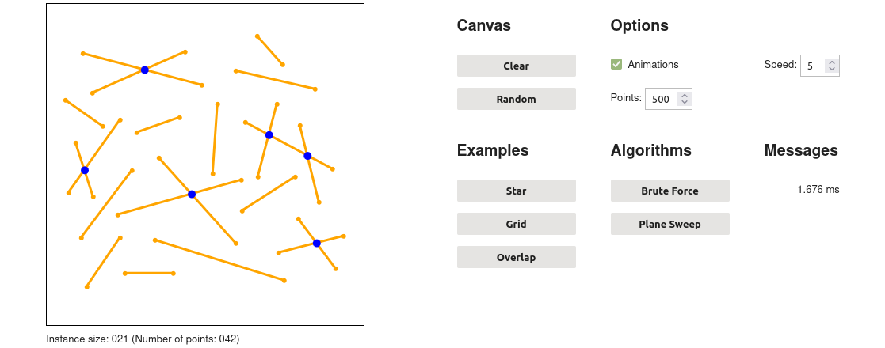

# Geometric Algorithms: Interactive Notebooks

The interactive Python notebooks collected in this repository serve as supplementary learning material for a university course on geometric algorithms.
They showcase and explain implementations of algorithms presented in the lectures.
Furthermore, they offer interactive visualisations and animations.

Code, explanations and visualisations are designed to complement each other, while keeping it viable to interact with only one of these aspects and ignore the others.
The algorithm explanations are partially based on the lectures and thus generally not self-contained, though it's possible to use the notebooks for self-study in conjuction with the provided [references](#references).

## Visualisations

Algorithms are visualised through a tool built with [ipywidgets](https://github.com/jupyter-widgets/ipywidgets) and [ipycanvas](https://github.com/martinRenou/ipycanvas).

The visualisation tool contains an interactive canvas.
Input instances can be constructed by clicking on the canvas, by generating random points or by loading previously registered example instances.
The tool also allows to register algorithms as well as run and animate them on the current input instance.

## Access Options

The notebooks are accessible online via [Binder](https://mybinder.org/), which provides a server-based Python kernel that can run implemented algorithms and the visualisation tool.
(TODO: Enable [JupyterLite](https://github.com/jupyterlite) access as an alternative execution environment and explain the differences.)

Of course, it's also possible to execute the notebooks offline in a local evironment.
Aside from downloading the notebooks themselves, this requires installing the dependencies specified in [environment.yml](./environment.yml).
The notebooks were originally written in Python 3.9 and tested up to the currently used version 3.11.

Another option is to view rendered versions of the notebooks without an execution environment, e.g. here on GitHub or through [nbviewer](https://nbviewer.org/).
Note that nbviewer has slightly nicer formatting than GitHub (as of April 2023).
The interactive visualisation tool isn't available in rendered versions.

## Table of Notebooks

All existing notebooks are listed in the following table, together with preview images for visualisations and direct links to the different access options.
Notebook no. 00 should be read first, as it explains how to use the visualisation tool and introduces a few important basics that are frequently needed throughout the other notebooks.
Those don't need to be read in order, but they might occasionally reference earlier notebooks.

| No.   | Title                                  | Preview  | Execute                          | Render                                 |
| :---: | :------------------------------------: | :------: | :------------------------------: | :------------------------------------: |
| 00    | **Basics**                             | —        | JupyterLite   [Binder][00-bd] | [nbviewer][00-nb]   [GitHub][00-gh] |
| 01    | **Convex Hull**                        | ![01-pr] | JupyterLite   [Binder][01-bd] | [nbviewer][01-nb]   [GitHub][01-gh] |
| 02    | **Line Segment**   **Intersection** | ![02-pr] | JupyterLite   [Binder][02-bd] | [nbviewer][02-nb]   [GitHub][02-gh] |
| 03    | **Polygon**   **Triangulation**     | ![03-pr] | JupyterLite   [Binder][03-bd] | [nbviewer][03-nb]   [GitHub][03-gh] |

[01-pr]: ./notebooks/images/01-image00.png
[02-pr]: ./notebooks/images/02-image00.png
[03-pr]: ./notebooks/images/03-image00.png

[00-bd]: https://mybinder.org/v2/gh/Jerik79/geoalg-notebooks/master?filepath=notebooks/00-Basics.ipynb
[01-bd]: https://mybinder.org/v2/gh/Jerik79/geoalg-notebooks/master?filepath=notebooks/01-ConvexHull.ipynb
[02-bd]: https://mybinder.org/v2/gh/Jerik79/geoalg-notebooks/master?filepath=notebooks/02-LineSegmentIntersection.ipynb
[03-bd]: https://mybinder.org/v2/gh/Jerik79/geoalg-notebooks/master?filepath=notebooks/03-PolygonTriangulation.ipynb

[00-nb]: https://nbviewer.org/github/Jerik79/geoalg-notebooks/blob/master/notebooks/00-Basics.ipynb
[01-nb]: https://nbviewer.org/github/Jerik79/geoalg-notebooks/blob/master/notebooks/01-ConvexHull.ipynb
[02-nb]: https://nbviewer.org/github/Jerik79/geoalg-notebooks/blob/master/notebooks/02-LineSegmentIntersection.ipynb
[03-nb]: https://nbviewer.org/github/Jerik79/geoalg-notebooks/blob/master/notebooks/03-PolygonTriangulation.ipynb

[00-gh]: ./notebooks/00-Basics.ipynb
[01-gh]: ./notebooks/01-ConvexHull.ipynb
[02-gh]: ./notebooks/02-LineSegmentIntersection.ipynb
[03-gh]: ./notebooks/03-PolygonTriangulation.ipynb

## Further Information

This section covers some background information about the notebook collection at hand.

### Documentation

TODO: Add documentation and information for developers.

### References

Each notebook contains references to resources with underlying and additional content.
Apart from the lectures, the most important resources are:

* *Computational Geometry: Algorithms and Applications*, 3rd edition, by Mark de Berg, Otfried Cheong, Marc van Kreveld and Mark Overmars (2008)

* *[CMSC 754: Computational Geometry (Spring 2020)](https://www.cs.umd.edu/class/spring2020/cmsc754/Lects/cmsc754-spring2020-lects.pdf)* by David M. Mount (2020)

The lectures themselves are mostly based on the book by de Berg et al., whereas Mount's lectures take a somewhat different and complementary approach.

### Related Work

The initial concept for this collection came from notebooks developed as part of student projects.
A particular inspiration was the notebook *[Algorithms for Computing the Fréchet Distance](https://github.com/792x/FrechetDistance)* by Casper Siksma and Dennis Arets.
There exist other interactive notebooks about geometric algorithms too, such as those compiled in the book *[Interactive Computational Geometry in Python](https://www.odbms.org/2018/04/interactive-computational-geometry-in-python/)* by Jim Arlow (2018).
Moreover, a great number of projects and scientific publications deal with the visualisation of (geometric) algorithms.
Some examples are [VisuAlgo](https://visualgo.net/), [RGeometry](https://rgeometry.org/), [LiveCG](https://github.com/sebkur/live-cg) and [CGVis](https://doi.org/10.1007/978-3-030-57717-9_21).
